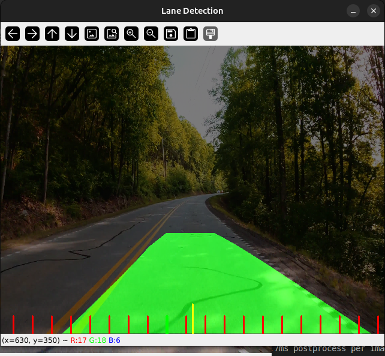
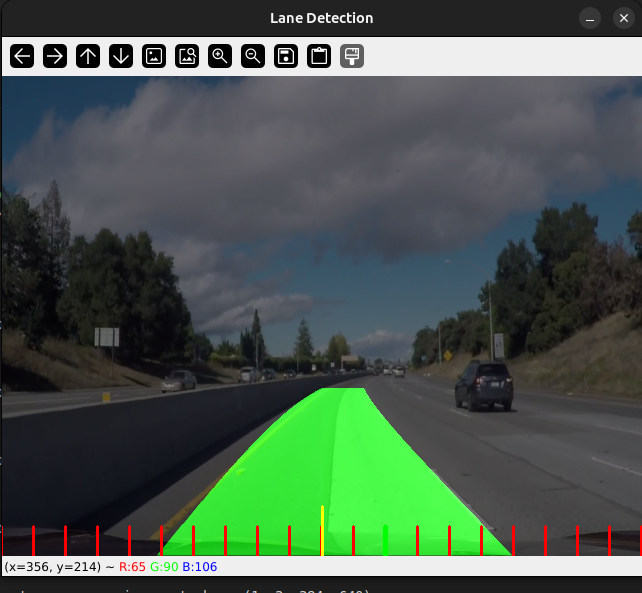
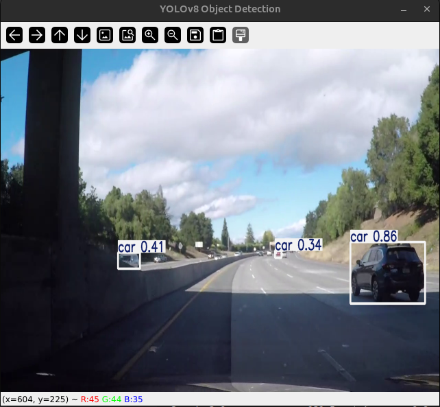
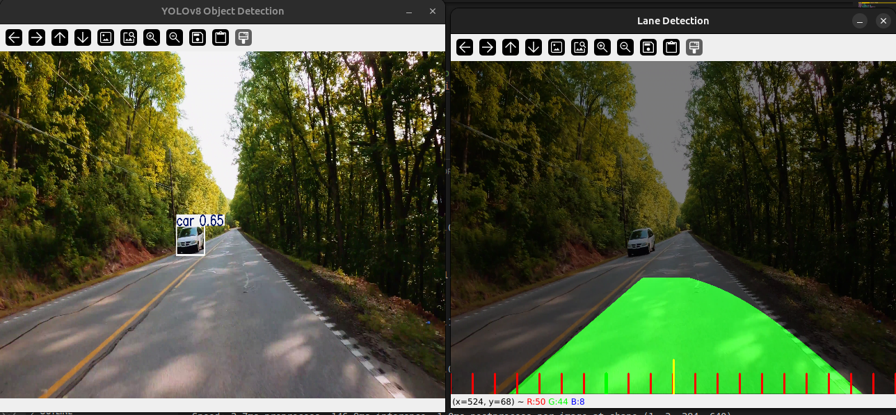

# Lane and Object Detection

## Overview

This project implements lane and object detection using computer vision techniques. The system processes video input to identify lane markings and detect objects such as vehicles and pedestrians.

## Repository Contents

- `main.py`: The main script that processes video input for lane and object detection.
- `Finalutils.py`: Contains utility functions used in the detection process.
- `challenge_video.mp4` and `project_video.mp4`: Sample videos for testing the detection algorithms.
- `requirements.txt`: List of required dependencies for the project.

## Implementation Details

### Object Detection (YOLOv8)
- The project uses **YOLOv8 (You Only Look Once)**, a real-time object detection model from Ultralytics.
- The `YOLOv8` model detects objects such as vehicles and pedestrians in the video frames.
- Each detected object is enclosed in a bounding box with a label and confidence score.
- The detection results are drawn directly on the video frame for real-time visualization.

### Lane Detection (Sliding Window Method)
- The lane detection system uses a **Sliding Window Technique** to detect lane lines in a bird’s-eye view of the road.
- The steps include:
  1. **Undistorting the Image**: Removes distortions from the camera.
  2. **Thresholding**: Applies color and edge detection to highlight lane lines.
  3. **Perspective Transformation**: Warps the image to get a top-down view of the road.
  4. **Sliding Window Search**: Identifies lane pixels by scanning the warped image.
  5. **Polynomial Fitting**: Fits a curve to the detected lane points to estimate lane boundaries.
  6. **Overlaying Lane Markings**: Draws detected lane boundaries on the original image.


## Installation

1. **Clone the repository**:

   ```bash
   git clone https://github.com/GlenFonceca/Lane-and-Object-Detection.git
   cd Lane-and-Object-Detection
   ```

2. **Create and activate a virtual environment**:

   ```bash
   python -m venv venv
   source venv/bin/activate  # On Windows: venv\Scripts\activate
   ```

3. **Install the required dependencies**:

   ```bash
   pip install -r requirements.txt
   ```

## Usage

To run the lane and object detection:

```bash
python3 main.py
```

By default, the video input path is set in the code. If you want to use a different video, update the path in `FinalLane.py`. For real-time detection using a webcam, set the video path to `0` in the code.

## Results

Here are some example results of the lane and object detection system:

### Lane Detection Output



### Object Detection Output



## Dependencies

The project requires the following Python packages:

- `ultralytics`
- `opencv-python`
- `numpy`

Ensure these packages are installed in your environment.

## Acknowledgments

This project utilizes open-source computer vision libraries and is inspired by various tutorials and research papers in the field of autonomous driving and computer vision.

## Contributors

Thanks to the following people who have contributed to this project:

- [Alson Mathias](https://github.com/alsonmathias) 
- [Dheeraj D Nayak](https://github.com/dheerajnayakk) 
- [Anush Shetty](https://github.com/anushshetty20)

## License

This project is open-source and available under the MIT License.

